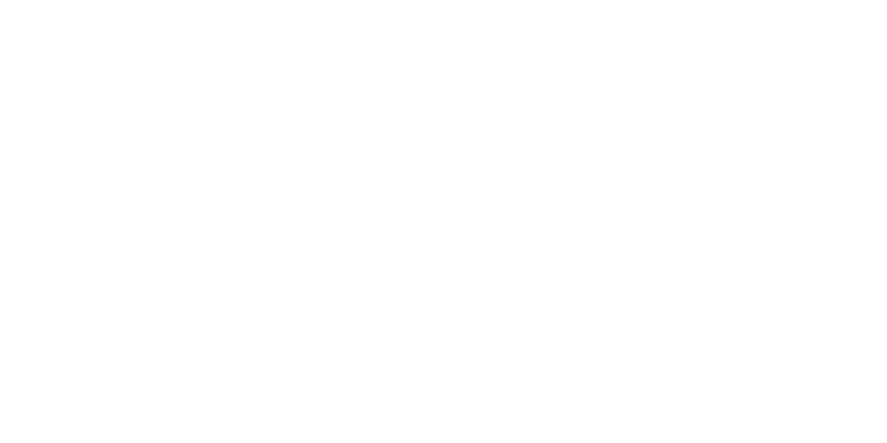

# Classy
Classy library. Classy is a lifecycle manager that builds on tags to make both composition and OOP architecture more appealing in Luau.

## Why Use Classy?
- You have the option of tracking instances with classes or functions.
- Classy handles the cleanup of a class object's metatable and the provided [Janitor](https://github.com/howmanysmall/Janitor) object.
- Full generic type safety is preserved when accessing applied objects.
- If you are a fanatic about object-oriented programming, this is the module for you! Simply create classes for game objects and track them with tags.
- Classy also heavily supports composition, allowing you to register and fetch attached components (ClassyObjects) from an instance.

## Installation
Classy is installable via [wally](https://wally.run/), and you can visit the page [here](https://wally.run/package/jaeymo/classy?version=1.0.1).

## Dependencies
- [Janitor](https://github.com/howmanysmall/Janitor)
- [Signal](https://github.com/Sleitnick/RbxUtil/blob/main/modules/signal/init.luau)
  
## Example: Kill Part System
Classy supports multiple construction patterns for the same system. Here is the class we will be using for the example:

```lua
--!strict

local Classy = require(path.to.classy)

local KillPartClass = {}
KillPartClass.__index = KillPartClass

export type KillPart = typeof(setmetatable({} :: {
	Part: BasePart,
	Janitor: Classy.Janitor,
}, KillPartClass))

function KillPartClass.new(part: Instance, janitor: Classy.Janitor): KillPart
	return setmetatable({
		Part = part :: BasePart,
		Janitor = janitor,
	}, KillPartClass)
end

function KillPartClass.Init(self: KillPart)
	self:_watchTouchedEvent()
end

function KillPartClass.DoSomething(self: KillPart)
	print(self)
end

function KillPartClass.Destroy(self: KillPart)
	print("This object has been destroyed!")
end

function KillPartClass._watchTouchedEvent(self: KillPart)
	self.Janitor:Add(self.Part.Touched:Connect(function(hit: BasePart)
		local humanoid = hit.Parent and hit.Parent:FindFirstChildWhichIsA("Humanoid")

		if not humanoid then
			return
		end

		humanoid.Health = 0
	end))
end
```

### Class-Based Construction

```lua
local KillPartClassy = Classy.newClass("KillPart", KillPartClass, {
	ClassNames = { "BasePart" },
	Ancestors = { workspace },
	Logging = true,
})
```

### Function-Based Construction

```lua
local AnotherExample = Classy.new("KillPart", function(instance: Instance, janitor: Classy.Janitor)
	return KillPartClass.new(instance, janitor)
end, {
	ClassNames = { "BasePart" },
	Ancestors = { workspace },
	Logging = true,
})
```

Both approaches construct the same underlying system.

```lua
KillPartClassy:Init()
AnotherExample:Init()
```

Once initialized, you can interact with applied objects directly:

```lua
KillPartClassy.InstanceAdded:Connect(function(instance, applied)
	applied:GetData():DoSomething()
end)
```

## Another Approach
Here is some clean and quick API if what you're making is simple and doesn't require a class:

```lua
local Classy = require(game.ReplicatedStorage.Packages.Classy)

Classy.new("KillPart", function(instance: BasePart, janitor: Classy.Janitor) 
	janitor:Add(instance.Touched:Connect(function(hit: BasePart)
		local Humanoid = hit.Parent and hit.Parent:FindFirstChildWhichIsA("Humanoid")
		if not Humanoid then 
			return 
		end

		Humanoid.Health = 0
	end))
end, {
	ClassNames = { "BasePart" },
	Ancestors = { workspace },
}):Init()
```